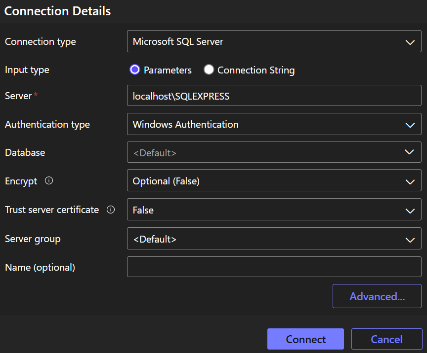
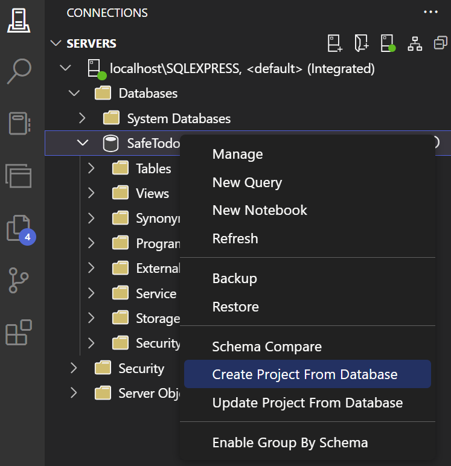
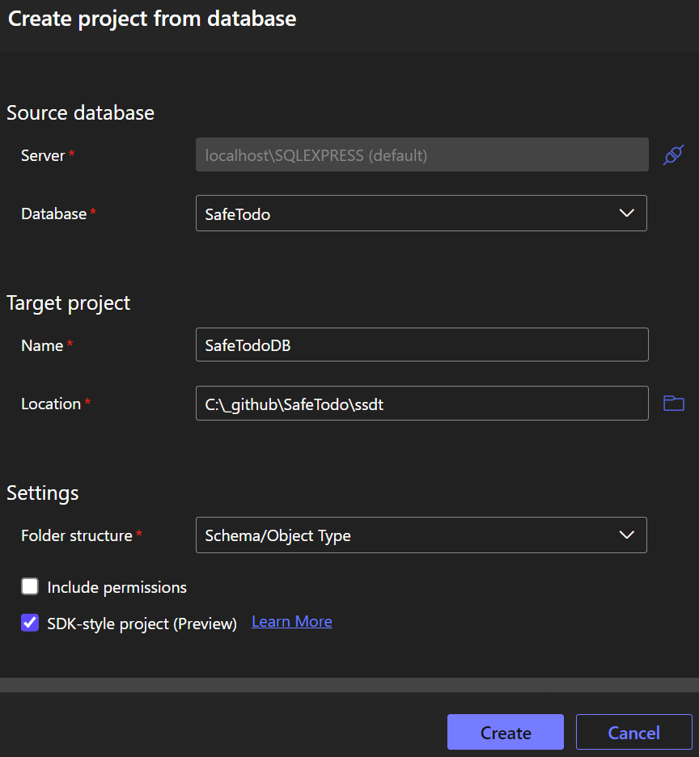

# Using SQLProvider SQL Server SSDT

## Creating a "SafeTodo" Database with Azure Data Studio

### Connecting to a SQL Server Instance
1) In the "Connections" tab, click the "New Connection" button


2) Enter your connection details, leaving the "Database" dropdown set to `<Default>`. If you are connecting to an SQL Server instance in a Docker container with default port settings, put `localhost` in the **Server** field and use `SQL Login` as **Authentication type**.



### Creating a new "SafeTodo" Database
- Right click your server and choose "New Query"
- Execute this script:

```sql
USE master
GO
IF NOT EXISTS (
 SELECT name
 FROM sys.databases
 WHERE name = N'SafeTodo'
)
 CREATE DATABASE [SafeTodo];
GO
IF SERVERPROPERTY('ProductVersion') > '12'
 ALTER DATABASE [SafeTodo] SET QUERY_STORE=ON;
GO

```

- Right-click the "Databases" folder and choose "Refresh" to see the new database.

_NOTE: Alternatively, if you don't want to manually create the new database, you can install the "New Database" extension in Azure Data Studio which gives you a "New Database" option when right clicking the "Databases" folder._

### Create a "Todos" Table
- Right-click on the **SafeTodo** database and choose "New Query"
- Execute this script:
``` sql
CREATE TABLE [dbo].[Todos]
(
  [Id] UNIQUEIDENTIFIER NOT NULL PRIMARY KEY,
  [Description] NVARCHAR(500) NOT NULL,
  [IsDone] BIT NOT NULL
)
```

## Creating an SSDT Project (.sqlproj)
At this point, you should have a SAFE Stack solution and a minimal "SafeTodo" SQL Server database with a "Todos" table.
Next, we will use Azure Data Studio with the "SQL Database Projects" extension to create a new SSDT (SQL Server Data Tools) .sqlproj that will live in our SAFE Stack .sln. 

1) Install the "SQL Database Projects" extension.

2) Right click the SafeTodo database and choose "Create Project From Database" (this option is added by the "SQL Database Projects" extension)



3) Configure a path within your SAFE Stack solution folder and a project name and then click "Create". NOTE: If you choose to create an "ssdt" subfolder as I did, you will need to manually create this subfolder first.



4) You should now be able to view your SQL Project by clicking the "Projects" tab in Azure Data Studio.


5) Finally, right click the SafeTodoDB project and select "Build". This will create a .dacpac file which we will use in the next step.


## Create a TodoRepository Using the new SSDT provider in SQLProvider

### Installing SQLProvider from NuGet
- Add the following lines to the `paket.dependencies` in the solution root:
```
nuget SQLProvider
nuget System.Data.SqlClient
```
- Add the following lines to `paket.references` in the src/Server folder:
```
System.Data.SqlClient
SQLProvider
```
### Initialize Type Provider
Next, we will wire up our type provider to generate database types based on the compiled .dacpac file.

1) In the Server project, create a new file, `Database.fs`. (this should be above `Server.fs`).

```fsharp
module Database
open FSharp.Data.Sql

[<Literal>]
let SsdtPath = __SOURCE_DIRECTORY__ + @"/../../ssdt/SafeTodoDB/bin/Debug/SafeTodoDB.dacpac"

// TO RELOAD SCHEMA: 1) uncomment the line below; 2) save; 3) recomment; 4) save again and wait.
//DB.GetDataContext().``Design Time Commands``.ClearDatabaseSchemaCache

type DB = 
    SqlDataProvider<
        Common.DatabaseProviderTypes.MSSQLSERVER_SSDT,
        SsdtPath = SsdtPath,
        UseOptionTypes = Common.NullableColumnType.OPTION
    >

let createContext (connectionString: string) =
    DB.GetDataContext(connectionString)
```

2) Create `TodoRepository.fs` below `Database.fs`.

``` fsharp
module TodoRepository
open FSharp.Data.Sql
open Database
open Shared

/// Get all todos that have not been marked as "done". 
let getTodos (db: DB.dataContext) = 
    query {
        for todo in db.Dbo.Todos do
        where (not todo.IsDone)
        select 
            { Shared.Todo.Id = todo.Id
              Shared.Todo.Description = todo.Description }
    }
    |> List.executeQueryAsync

let addTodo (db: DB.dataContext) (todo: Shared.Todo) =
    async {
        let t = db.Dbo.Todos.Create()
        t.Id <- todo.Id
        t.Description <- todo.Description
        t.IsDone <- false

        do! db.SubmitUpdatesAsync() |> Async.AwaitTask
    }
```

3) Create `TodoController.fs` below `TodoRepository.fs`.

``` fsharp
module TodoController
open Database
open Shared

let getTodos (db: DB.dataContext) = 
    TodoRepository.getTodos db |> Async.AwaitTask

let addTodo (db: DB.dataContext) (todo: Todo) = 
    async {
        if Todo.isValid todo.Description then
            do! TodoRepository.addTodo db todo
            return todo
        else 
            return failwith "Invalid todo"
    }
```

4) Finally, replace the stubbed todosApi implementation in `Server.fs` with our type provided implementation.

``` fsharp
module Server

open Fable.Remoting.Server
open Fable.Remoting.Giraffe
open Saturn
open System
open Shared
open Microsoft.AspNetCore.Http

let todosApi =
    let db = Database.createContext @"Data Source=.\SQLEXPRESS;Initial Catalog=SafeTodo;Integrated Security=SSPI;"
    { getTodos = fun () -> TodoController.getTodos db
      addTodo = TodoController.addTodo db }

let webApp =
    Remoting.createApi()
    |> Remoting.withRouteBuilder Route.builder
    |> Remoting.fromValue todosApi
    |> Remoting.withErrorHandler fableRemotingErrorHandler
    |> Remoting.buildHttpHandler

let app =
    application {
        use_router webApp
        memory_cache
        use_static "public"
        use_gzip
    }

run app
```

## Run the App!
From the VS Code terminal in the SafeTodo folder, launch the app (server and client):

`dotnet run`

You should now be able to add todos.


## Deployment
When creating a Release build for deployment, it is important to note that SQLProvider SSDT expects that the .dacpac file will be copied to the deployed Server project bin folder. 

Here are the steps to accomplish this:

1) Modify your Server.fsproj to include the .dacpac file with "CopyToOutputDirectory" to ensure that the .dacpac file will always exist in the Server project bin folder.

```
<ItemGroup>
    <None Include="..\{relative path to SSDT project}\ssdt\SafeTodo\bin\$(Configuration)\SafeTodoDB.dacpac" Link="SafeTodoDB.dacpac">
        <CopyToOutputDirectory>PreserveNewest</CopyToOutputDirectory>
    </None>
    
    { other files... }
</ItemGroup>
```

2) In your Server.Database.fs file, you should also modify the SsdtPath binding so that it can build the project in either Debug or Release mode:

```F#
[<Literal>]
#if DEBUG
let SsdtPath = __SOURCE_DIRECTORY__ + @"/../../ssdt/SafeTodoDB/bin/Debug/SafeTodoDB.dacpac"
#else
let SsdtPath = __SOURCE_DIRECTORY__ + @"/../../ssdt/SafeTodoDB/bin/Release/SafeTodoDB.dacpac"
#endif
```

NOTE: This assumes that your SSDT .sqlproj will be built in Release mode (you can build it manually, or use a FAKE build script to handle this).
